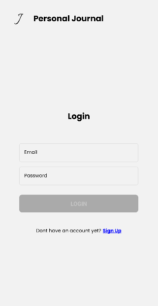
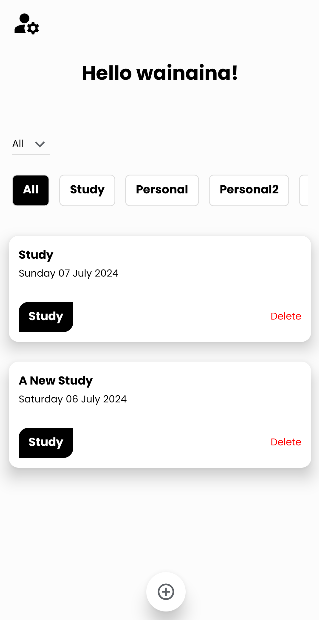

<h1>After cloning the repo</h1>

1. Navigate to the project root folder.
2. run `npm install`
3. run `npx react-native-asset` to link the assets
4. Open two terminals and:
   1. in one terminal run `npm run start`
   2. in the other terminal run `npm run android` (project is build to support android)
5. If you have configured AVD or if you have connected your phone, then whichever is detected first should execute the application

<h1>Screenshots</h1>

<h3>Login</h3>

<h3>Home</h3>

<h3>Demo Video 1 - E2E Flow</h3>

<h3>Demo Video 2 - Adding New Category</h3>

